# Mapa general del sitio

Diagrama de páginas, enlaces, superficies globales y flujos principales de
CrececonIA. Se actualiza junto con las rutas del App Router y los componentes
globales montados en `app/layout.tsx`.

```mermaid
flowchart TD
  HOME["/ · Inicio"]
  IA["/ia · Enlace simplificado"]
  APRENDER["/aprender · Capa aprender"]
  MENTORIA["/mentoria · Capa acompañamiento"]
  IMPLEMENTAR["/implementacion · Capa implementación"]
  PROTOCOLO["/protocolo-bpi · Método"]
  LLAMADA["/solicitar-llamada · Solicitud"]
  WA["WhatsApp · canal comercial"]

  HOME -->|"Encontrar mi siguiente paso"| HOME_LAYERS["Escalera de servicios"]
  HOME_LAYERS --> APRENDER
  HOME_LAYERS --> MENTORIA
  HOME_LAYERS --> IMPLEMENTAR
  HOME -->|"Abrir enlace para Instagram"| IA
  HOME -->|"Conocer el protocolo"| PROTOCOLO
  HOME -->|"Hablar"| WA
  APRENDER -->|"Ebooks y guías"| EBOOKS
  APRENDER -->|"Calificar y avanzar"| WA
  MENTORIA -->|"Calificar y avanzar"| WA
  IMPLEMENTAR -->|"Calificar y avanzar"| WA
  PROTOCOLO -->|"Volver al manifiesto"| HOME
  LLAMADA -->|"Inicio"| HOME

  subgraph HUB["Hub de recursos"]
    CENTRO["/centro · Centro"]
    GUIAS["/centro/guias · Guías"]
    SKILLS["/centro/skills · Skills"]
    ENLACES["/centro/enlaces · Enlaces"]
    TEMA["/centro/[tema] · Categoría"]
    GUIA["/guias/[slug] · Guía"]
    SKILL["/skills/[slug] · Skill"]
    CENTRO --> GUIAS
    CENTRO --> SKILLS
    CENTRO --> ENLACES
    CENTRO --> TEMA
    GUIAS --> GUIA
    SKILLS --> SKILL
    TEMA --> GUIAS
    TEMA --> SKILLS
  end
  APRENDER --> CENTRO
  GUIA -->|"Contenido relacionado"| GUIA
  SKILL -->|"Contenido relacionado"| SKILL

  subgraph STORE["Tienda y ventas de ebooks"]
    EBOOKS["/ebooks · Catálogo"]
    PRODUCTO["/ebook/[slug] · Producto"]
    COMBO["?bundle=slug#comprar · Combo"]
    FLOW["/api/flow/create · Checkout Flow"]
    CONFIRM["/api/flow/confirm · Confirmación"]
    SUCCESS["/ebook/.../success · Compra confirmada"]
    DESCARGAR["/ebook/descargar · Recuperar descargas"]
    DOWNLOAD["/api/ebook/download · PDF privado"]
    CUPOS["/api/ebook/cupos · Precio vigente"]
    WAITLIST["/api/ebook/waitlist · Aviso de lanzamiento"]
    EBOOKS --> PRODUCTO
    EBOOKS --> COMBO
    PRODUCTO -->|"Precio y cupos"| CUPOS
    PRODUCTO -->|"Comprar"| FLOW
    COMBO --> FLOW
    FLOW -->|"Pago aprobado"| CONFIRM
    CONFIRM --> SUCCESS
    CONFIRM -->|"Email con enlaces"| DOWNLOAD
    SUCCESS --> DOWNLOAD
    DESCARGAR -->|"Verificar email"| DOWNLOAD
    PRODUCTO -->|"Próximamente"| WAITLIST
    EBOOKS --> DESCARGAR
  end
  APRENDER --> EBOOKS
  IA --> APRENDER

  subgraph GLOBAL["Superficies globales y pop-ups"]
    POP_EBOOK["EbookPopup · Home · 4 s"]
    POP_EMAIL["EmailPopup · Guías/skills · 25 s"]
    POP_SUB["SuscriptorPopup · Contenido"]
    POP_EVAL["EvaluacionModal · diagnóstico"]
    CHAT["ChatWidget · botón flotante"]
    NAV["Navbar · navegación principal"]
    FOOTER["Footer · enlaces secundarios"]
  end
  HOME -.-> POP_EBOOK
  GUIA -.-> POP_EMAIL
  SKILL -.-> POP_EMAIL
  CENTRO -.-> POP_SUB
  HOME -.-> POP_EVAL
  APRENDER -.-> POP_EVAL
  MENTORIA -.-> POP_EVAL
  IMPLEMENTAR -.-> POP_EVAL
  HOME -.-> CHAT
  PRODUCTO -.-> CHAT
  GUIA -.-> CHAT
  SKILL -.-> CHAT
  NAV --> HOME
  NAV --> IA
  NAV --> CENTRO
  NAV --> WA
  FOOTER --> IA
  FOOTER --> APRENDER
  FOOTER --> MENTORIA
  FOOTER --> IMPLEMENTAR
  FOOTER --> WA

  classDef entry fill:#c6db70,stroke:#151618,color:#151618,stroke-width:1px;
  classDef commerce fill:#9caee3,stroke:#151618,color:#151618,stroke-width:1px;
  classDef overlay fill:#17191b,stroke:#c6db70,color:#f2efe8,stroke-width:1px;
  class HOME,IA,APRENDER,MENTORIA,IMPLEMENTAR entry;
  class EBOOKS,PRODUCTO,COMBO,FLOW,CONFIRM,SUCCESS,DESCARGAR,DOWNLOAD,CUPOS,WAITLIST commerce;
  class POP_EBOOK,POP_EMAIL,POP_SUB,POP_EVAL,CHAT,NAV,FOOTER overlay;
```

## Lectura del mapa

- Las flechas sólidas representan navegación o continuidad de un flujo.
- Las flechas punteadas representan una superficie que aparece encima de una
  página sin reemplazar su contenido.
- El flujo de compra mantiene el checkout de Flow, la confirmación por webhook,
  la entrega por email y la recuperación posterior.
- Las páginas de producto son el destino natural para campañas; `/ebooks` es
  el destino general para tráfico que todavía está explorando.
